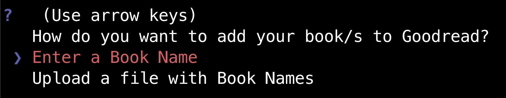

# Goodreads-file-uploader

Goodreads-file-uploader is a Python Script to add a list of book titles to your want_to_read shelf on [Goodreads](https://www.goodreads.com/).
Is a way to upload a list of titles at once, without going one by one.
Just write all your book titles line by line in a .txt file and run the script.

## Summary

  - [Installation](#installation)
  - [Runing the Script](#running-the-script)
  - [Tests](#tests)
  - [Built With](#built-with)
  - [To-Do](#to-do)
  - [What I learn](#what-i-learned)
  - [Contributing](#contributing)
  - [Authors](#authors)
  - [License](#license)
  - [Acknowledgments](#acknowledgments)

## Installation

What things you need to install the software:

* Python 3 (we recomend to use Virtual Environments)

These instructions will get you a copy of the project up and running on
your local machine for development, use and/or testing purposes.

    $ git clone https://github.com/DobleV55/Goodreads.git
    
    $ cd Goodreads/
    
    $ pip install -r requirements.txt
    
    $ cd goodreads/
    
    $ python goodreads.py

### Running the Script

You need to choose between enter a Book Name or Upload a file of titles.
If option 1 is chosen, the script will ask you for your goodreads account credentials (email and password) and then to enter a Book Title.
The script will automatically log-in, search for the book and add the book to your Want-to-Read Shelf.
If option 2 is chosen, the script will ask you for your goodreads account credentials and a file with extension .txt with your book titles [like this](tests/book-titles-example.txt).

## Tests

### How to run the tests

From inside Goodreads project, you can execute:

    $ pytest
    
To run the tests that are located at tests/test_goodreads.py

### Break down into end to end tests

Explain what these tests test and why.

    Give an example

## Built With

  - [Python 3.8.3](https://www.python.org/downloads/release/python-383/) - Python is a programming language that lets you work quickly
and integrate systems more effectively.
  - [Cookiecutter](https://cookiecutter.readthedocs.io/) - Cookiecutter creates projects from project templates, e.g. Python package projects.
  - [Beautifulsoup4](https://pypi.org/project/beautifulsoup4/) - Beautiful Soup is a library that makes it easy to scrape information from web pages.
  - [Click](https://pypi.org/project/click/) - Click is a Python package for creating beautiful command line interfaces in a composable way with as little code as necessary.
  - [Requests](https://pypi.org/project/requests/) - Requests allows you to send HTTP/1.1 requests extremely easily.
  - [PyInquirer](https://pypi.org/project/PyInquirer/) - A collection of common interactive command line user interfaces.
  
## To-Do

- [] When finish option 1 or 2, ask again to add a book.
- [] Add login option. (If user not loged-in, disable add-book options)
- [] Add exit option.
- [] Conserve session when input credentials. (moving the requests.Session to __name__)
- [] Check what happens if the book is already on the Want to Read shelf.
- [] Posibility to create a new shelf.
- [] Posibility to add books to a different shelf.
- [] When option 2 is selected, ask for normal or forced option.
  - [] Normal - shows the link to the book and asks if its correct.
  - [] Forced - add directly the book that finds on goodreads.
- [] Add tests.
- [] Explain those tests in this file.
- [] Python Classes implementation, add comments and review code for changes.  
  
## What I Learned

Whit this Python project I learn a lot about:
* Python Requests - Creating Sessions, login in and send jsons with POST methods once logged in.
* Beautifulsoup - Obtaining X-CSRF-Token, search for specific meta_tags and parse html.
* Cookiecutter - Creating python package projects, build a project template to use on another projects and project licenses.
* Click - Create password inputs, create email inputs, use those two in the code to log-in.
* PyInquirer - Create a nice menu with multiple options and colors using Python Inquirer tools.
* Goodreads - A little bit of how it works and how they send the data from the browser.
* Python - Sending information as parameters through functions mainting the Beatifulsoup session, json structure and implementation with variables, data types, operators, lists, dictionaries and use of statements.

## Contributing

Please read [CONTRIBUTING.md](CONTRIBUTING.md) for details on our code
of conduct, and the process for submitting pull requests to us.

## Authors

  - **Valentin Vila** -
    [My GitHub](https://github.com/DobleV55)

See also the list of [contributors](https://github.com/DobleV55/Goodreads/graphs/contributors) who participated in this project.

## License

This project is licensed under [MITM](https://github.com/DobleV55/Goodreads/blob/master/LICENSE) - see the [LICENSE.md](LICENSE.md) file for
details

## Acknowledgments

  - To Agus that shows me Goodreads.
